# Pertemuan ke 14 : Praktik Aktuator LED dan Relay


## Topik Bahasan
Proyek Dasar Internet of Things I (Praktik Pemrograman Mikrokontroler, Praktik Sensor: Sensor DHT, LCD, Praktik Sensor: Ultrasonic, PIR, dan LDR, Praktik Aktuator: LED dan Relay, Praktik Aktuator: Buzzer dan Servo)

## Deskripsi
- Mampu melakukan instalasi, memahami bahasa pemrograman dan pin pada Arduino. 
- Mampu melakukan uji coba serial monitor dan uji coba PWM dengan potensiometer.
- Mampu merancang dan membuat proyek menggunakan sensor DHT22.
- Mampu merancang dan membuat proyek menggunakan sensor Ultrasonic, PIR, dan LDR.
- Mampu merancang dan membuat proyek menggunakan aktuator LED dan Relay.
- Mampu merancang dan membuat proyek menggunakan aktuator Buzzer dan Servo.

## Teori Singkat

### Pengertian Aktuator

**Aktuator** adalah sebuah peralatan mekanis untuk menggerakkan atau mengontrol sebuah mekanisme atau sistem. Aktuator diaktifkan dengan menggunakan lengan mekanis yang biasanya digerakkan oleh motor listrik. Aktuator biasanya adalah suatu output dari suatu sistem yang dikendalikan mikrokontroller.

Contoh: Motor DC, relay, solenoid valve, servo motor, stepper motor, dll.

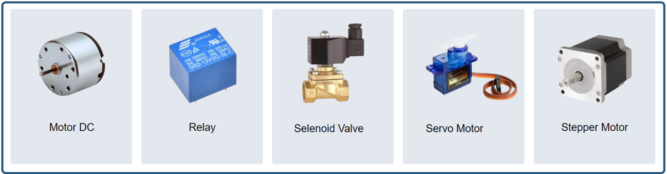


### LED (Light Emmiting Diode)

**LED (Light Emmiting Diode)** merupakan  komponen elektronika yang dapat memancarkan  cahaya ketika diberikan tegangan maju. LED merupakan keluarga Dioda yang terbuat dari bahan semikonduktor.

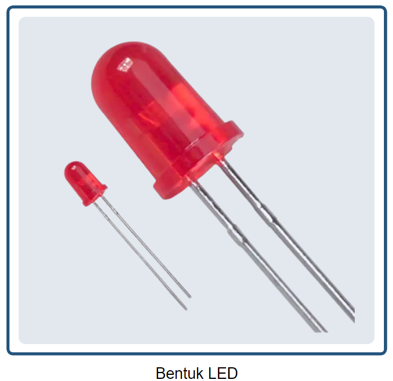

**Cara kerja LED** hampir sama dengan Dioda yang memiliki dua kutub yaitu kutub Positif (P) dan Kutub Negatif (N).  LED hanya akan memancarkan cahaya apabila dialiri tegangan maju (bias forward) dari Anoda menuju ke Katoda.

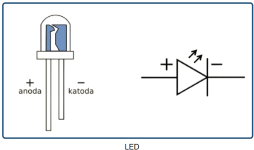

**Penggunaan LED**
LED memiliki 2 buah kaki, yaitu:

- Anoda (+) yang memiliki kaki lebih panjang dan dihubungkan ke sumber tegangan positif.
- Katoda (-) yang memiliki kaki lebih pendek dan dihubungkan ke ground.

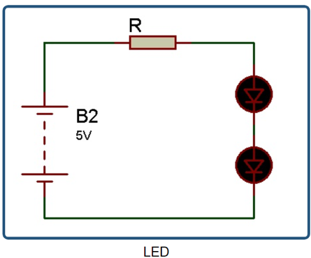

### Relay
**Relay** adalah saklar elektromekanikal yang digunakan untuk membuka dan menutup rangkaian listirk serta menstimulasi listrik kecil untuk mengendalikan katup pada arus yang lebih besar.  Komponen yang menyusun relay ada diantaranya yaitu elektromagnetik (coil), armature, switch contact point (saklar), dan spring.

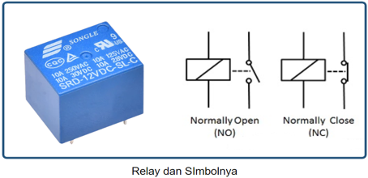

**Cara Kerja Relay**

Relay bekerja atau aktif saat coil dipicu dengan tegangan positif atau negatif (tergantung spesifikasi). Saat relay aktif maka akan merubah pin NO menjadi terhubung, dan NC menjadi terputus. Terdapat 2 mode dalam relay yaitu NO (Normally Open) dan NC (Normally Close).

NO merupakan kondisi pin relay terbuka (tidak terhubung) jika relay tidak aktif. NC merupakan kondisi pin relay sudah terhubung saat relay tidak aktif, sehingga saat relay aktif pin NC akan terputus/terbuka.

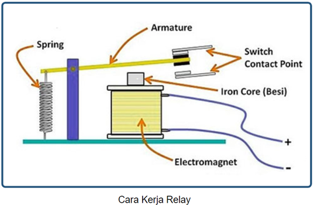

**Implementasi Relay** 

Relay banyak sekali diimplementasikan di industri, otomotif, dll.
Relay tersebut berfungsi memutus dan menghubungkan arus listrik sesuai dengan keinginan. Contoh pada gambar disamping, lampu akan menyala apabila mendapatkan sinyal input pada input relay.

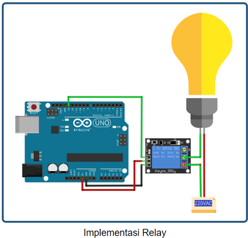

## Praktikum 1: Arduino, HC-SR04 dan LED

Selesaikan langkah-langkah praktikum berikut ini menggunakan Wokwi di browser Anda.

1. Masuk ke Wokwi. Klik New Projects untuk membuat projek baru. Pilih Arduino UNO.

 

2. Tambahkan komponen baru dengan klik Add (+).Tambahkan HC-SR04 Sensor Ultrasonik, 3 buah LED

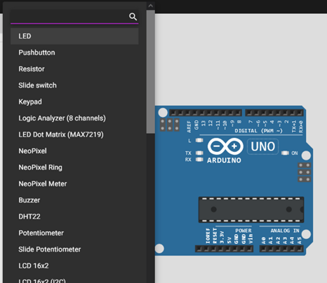 

3. Hubungkan seluruh komponen sebagai berikut.

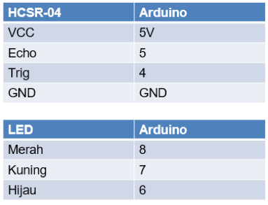 
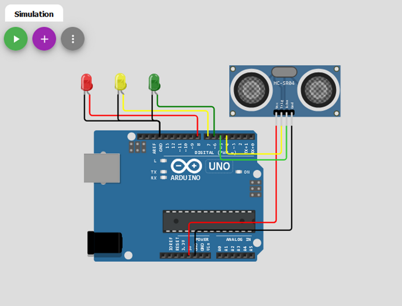 

   
4. Buatlah program seperti ditunjukan pada gambar.
Program tersebut digunakan untuk memberikan notifikasi ketinggian air menggunakan LED.
+ LED merah = air tinggi
+ LED Kuning = air sedang
+ LED Hijau = air rendah

Klik Start Simulation untuk memulai simulasi.

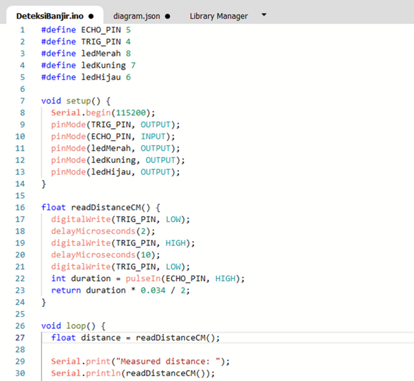 

5. Klik Sensor Ultrasonik.
+ Atur jarak menjadi <100 cm, lampu kuning akan menyala
+ Atur jarak menjadi <50 maka lampu hijau akan menyala.
+ Jika jarak lebih dari 100 cm maka lampu merah akan menyala
Klik Stop Simulation untuk menghentikan simulasi.

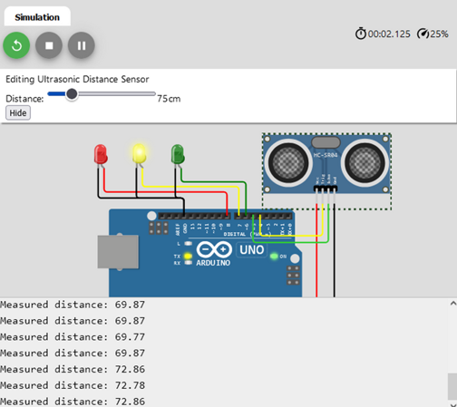 
 


## Praktikum 2: Praktik Arduino dan Sensor PIR


Selesaikan langkah-langkah praktikum berikut ini menggunakan Wokwi di browser Anda.

1. Masuk ke Wokwi. Klik New Projects untuk membuat projek baru. Pilih Arduino UNO.

 

2. Tambahkan komponen baru dengan klik Add (+). Tambahkan Sensor PIR. Tambahkan LED dan resistor.


3. Hubungkan seluruh komponen sebagai berikut.
- VCC -> 5V
- D -> 2
- Gnd -> GND

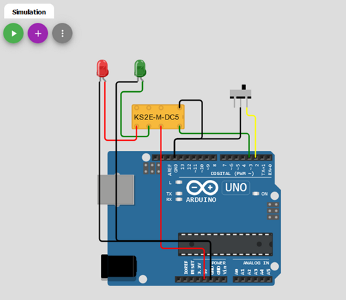

4. Tambahkan kode program. Program tersebut digunakan untuk menampilkan hasil pembacaan data sensor PIR atau motion. Hasil pembacaan berupa teks di Serial Monitor atau LED yang menyala

```cpp
int ledPin = 13;
int inputPin = 2;
int pirState = LOW;
int val = 0;

void setup(){
  pinMode(ledPin, OUTPUT);
  pinMode(inputPin, INPUT);

  Serial.begin(9600);
}

void loop(){
  val = digitalRead(inputPin);
  if (val == HIGH){
    digitalWrite(ledPin, HIGH);
    if (pirState == LOW){
      Serial.println("Gerakan terdeteksi!");
      pirState = HIGH;
    }
  } else {
    digitalWrite(ledPin, LOW);
    if (pirState == HIGH){
      Serial.println("Tidak ada gerakan!");
      pirState = LOW;
    }
  }
}
```

5. Klik Sensor PIR, dan klik Simulate motion untuk mensimulasikan adanya suatu gerakan.
Klik Stop Simulation untuk menghentikan simulasi. Muncul tulisan pada serial monitor, dan lampu LED akan menyala. LED akan mati saat tidak terdapat gerakan.

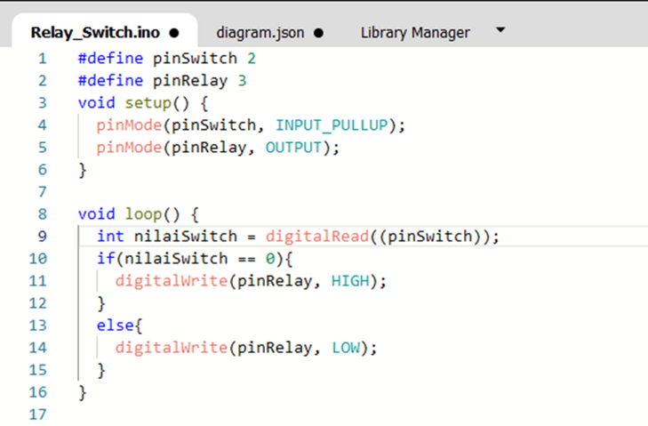


## Praktikum 3: Praktik Arduino dan Sensor LDR

Selesaikan langkah-langkah praktikum berikut ini menggunakan Wokwi di browser Anda.

1. Masuk ke Wokwi. Klik New Projects untuk membuat projek baru. Pilih Arduino UNO.

 

2. Tambahkan komponen baru dengan klik Add (+). Tambahkan Sensor Photoresistor (LDR). Tambahkan LED dan resistor. Tambahkan LCD 16x2 (I2C).


3. Hubungkan seluruh komponen sebagai berikut.


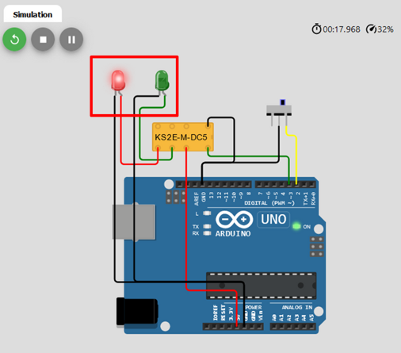
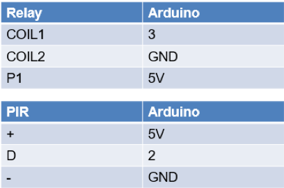

4. Buatlah program seperti ditunjukan pada gambar. Program tersebut digunakan untuk membaca nilai pembacaan sencor cahaya (lux) dan ditampilan pada LCD. Selain LCD, lampu LED akan hidup sesuai dengan nilai yang diperoleh sensor LDR. Klik Start Simulation untuk memulai simulasi.


5. Klik Sensor LDR, dan atur nilai sesuai dengan keinginan. Klik Stop Simulation untuk menghentikan simulasi. Saat nilai lux tinggi maka LED akan mati dan LCD menunjukkan cahaya terang. Saat nilai lux rendah maka LED akan menyala dan LCD menunjukkan cahaya gelap.

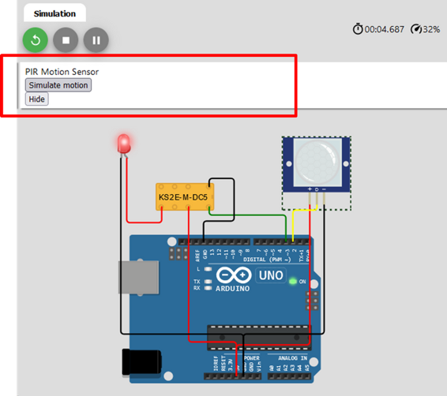


## Praktik ESP dengan Wokwi/ Praktik Riil


**Berikut contoh implementasi sensor ultrasonik di ESP32 micropython**

+ Wiring


+ Coding

https://wokwi.com/projects/404851305115009025

+ Hasil


**Berikut contoh implementasi sensor PIR di ESP32 micropython**
+ Wiring


  
+ Coding

https://wokwi.com/projects/404881060239442945

+ Hasil


  
## Tugas Mandiri 
Selesaikan langkah-langkah praktikum berikut ini menggunakan Wokwi di browser Anda.

**Tugas 1**
- Buatlah program yang dapat mendeteksi adanya gerakan (motion) khusus pada malam hari.


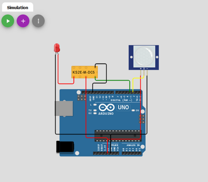


